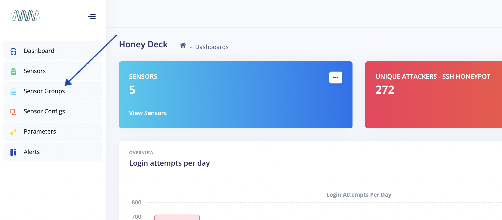
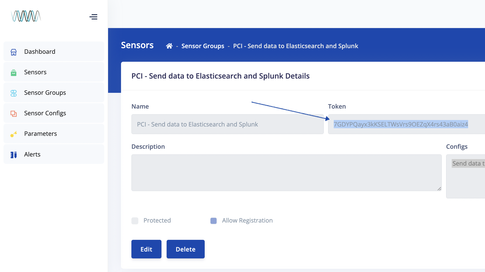

# Installation Guide

## Prerequisites

### Hardware and Operating System Requirements

Resonate Sensors should be deployed on machines with the following specifications:

- Standard x86_64 Architecture
- Fedora-based OS such as Amazon Linux, CentOS, or Red Hat Linux
- Cloud based and on-prem deployments are supported
- 1 CPU or vCPU Core
- At least 2gb of Memory
- At least 16gb of free Disk Space

Hardware Requirements vary based on the placement and volume of engagement the sensor has with attackers. Sensors placed within the network may only need minimal hardware, while internet-facing sensors can expect higher volumes of traffic and may require additional resources.

Resonate Sensors are intended to operate on dedicated systems for both security and performance reasons.

### Network and Firewall Rules

See the [Firewall Ports and Network Diagram](https://github.com/intercept-security/honeydeck2/blob/dev/docs/architecture_overview.md#firewall-ports-and-network-diagram) section of the [Architecture Overview](https://github.com/intercept-security/honeydeck2/blob/dev/docs/architecture_overview.md).


### System User Permissions

Resonate Sensors follow a least-privilege model to host intelligence-gathering services. However, the sensor software itself operates as `root` to configure the system. Installation of the sensor will require a user with the below specifications.

A user dedicated user can be created for the Resonate Sensor, or a default user such as `ec2-user` or `centos` can be leveraged.

The user should have passwordless sudo permissions. This is used to:
  - Install required packages
  - Configure systemd services
  - Move the sshd port
  - Assign processes permission to use  ports with values below 1024
  - Write logs to the `/var/log/resonate` directory

The user can be granted passwordless sudo by adding it to a group that already has the permission (such as `wheel` or `sudo`) or by granting it explicitly in the sudoers file.

Resonate Sensors are intended to operate on dedicated systems for both security and performance reasons.


### Sensor Group Configuration

Log into Resonate Detect Platform Console and select "Sensor Groups" from the sidebar. 



If the desired Sensor Group already exists, click on it, and then copy the "Group Token" from the detail view. 

If creating a new Sensor Group, click "Add Group." Afterwards, click on the new group, and then copy the "Group Token" from detail view.

Keep this token safe - the new Sensor will use this token to register itself to the platform in future steps.




## Installation

### Copying and Unarchiving the Software Package

Use Terminal or an SCP client to copy the Resonate Sensor software package to the target machine, and then unzip the archive.

#### On Windows
Use an SCP client such as [WinSCP](https://winscp.net/) to upload the Resonate Detect package to the destination server.  Afterwards, use an SSH client such as [PuTTY](https://www.putty.org/) to connect to the server.

#### On MacOS or Linux
Use the command-line scp command to upload the package like so:
`scp ~/Downloads/resonate-sensor.zip user@destination-server.com:.`

Afterwards, ssh into the server:
`ssh user@destination-server.com`

#### Unarchive the File
Once you've connecting to the server via SSH, move the package to its installation directory, and unarchive the file. Example:

```bash
mv resonate-sensor.zip ~resonate-user/
cd ~resonate-user
unzip resonate-sensor.zip
```


### Installing the Resonate Sensor

Once the package is unarchived, navigate to the sensor directory and copy honeydeck_sensor_sample.yml to honeydeck_sensor.yml

`cd honeydeck-sensor`
`cp honeydeck_sensor_sample.yml honeydeck_sensor.yml`

Edit honeydeck_sensor.yml, populating the following values:
- `honeydeck_server` should contain the url (including 'https://') to the Resonate Detect Platform Server.  Do not including a trailing '/' at the end of the URL.
- `sensor_group_token` should contain the Group token gathered from previous steps in this guide.
- `sensor_name` can optionally be population to set the name of the sensor.  If left blank, one will be randomly generated and assigned to it.

Run the installer script. The script will install all required packages and configure the sensor to check into the Platform Server. Remember that the user must have passwordless sudo privilegse.
`./install.sh`

_Note: The codebase for Resonate Detect was originally titled "Honeydeck" until Resonate Technologies, Inc. was formed.  The codebase is being updated to reflect its new moniker over time._


### Registering the Sensor

The Resonate Sensor package comes with a script to make connecting sensors to the platform a one-step process.

Run the Sensor Registration script:
`./register_sensor.sh`

The script will use values from the honeydeck_sensor.yml file and register the sensor to the Sensor Group associated with the specified Sensor Group token.


### Updating the Sensor Configuration

By default, the sensor will poll for new configurations every fifteen minutes. However, an update can be manually executed but running the updater script.

`./update.sh`

The script will use values from the honeydeck_sensor.yml file and download the latest configurations assigned to its Sensor Group.

_Note: Remember that the user executing the update script must have passwordless sudo privileges._
